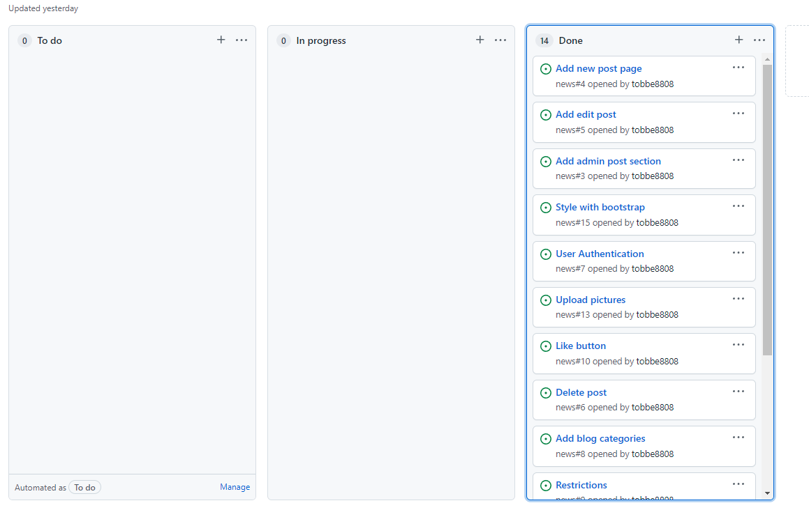

# NewsBlog

## Technologies
HTML5
CSS
jQuery
JavaScript
Python3
MVC Framework
Django
Bootstrap
Gitpod
Github
Heroku
Heroku Postgres
Code Institute template
Agile "Githubs"
Code Validators

## Testing

**HTML**

No errors returned when passing through the official W3C Validator

**CSS**

No errors were found when passing through the official (Jigsaw) Validator

**Python PEP8**

No errors returned when passing through the official Python PEP8 Validator.

**Lighthouse**

Tested so the website had good scores and it did.

## Testing website

## Not logged in.

1. Newblognav - The newsblog nav reroutes to the home page as expected.

2. Category drop down works as expected.

3. All the Categorie Links in the navbar works as expected.

4. Registration form works as expected.

5. login works as expected.

6. Not Registered? Sign Up here link works if you you're not signed in.

7. Cant Like or add post if youre not registerd Autentication works as expected.

8. Can see all blogpost as unregisterd works as expected.

9. Categories works and are filtering them correct.

## Logged in

1. Everything as a free user above works as expected when ur logged in exept you got no restrictions like the not logged in user has.

2. Editing posts works as expected.

3. deletion of posts works as expected.

4. The dropdown far right on the website work as expected and all its links, and shows users first and lastname.

5. Edit settings page works, and you can change ur details.

6. Edit Profile page works and you can add profile picture and change socials as expected.

7. Show profile page works as expected and Links to all socials you put up works, and bio.

8. Add Post works as expected, also the add header picture works as expected.

9. If you are a new user the page allows you to create a profile page and that works as expected.

# User stories

 

1. As a user i want to be able to login.
2. Be able to do blog posts
3. Able to add images.
4. able to delete/edit my post.
5. change my profile settings adding socials bio.
6. Filter topics by categories.
7. Be able to like posts and also regret the like.
8. Be able to comment on posts.
9. be able to logout.
10. Look at other peoples

## Deployment

### Github pages
Upload to Github pages 
1. I started by choosing the Repository that i wanted to upload to github pages. 
2. I choose the main branch since i got a test branch as well. 
3. Then i clicked on settings. 
4. I scrolled down to GitHub Pages and clicked Check it out here. 
5. Then i choose the main Branch and root and then save. 
6. It's now uploaded to Github pages. 

### Heroku

1. set  DEBUG = False, Add X_FRAME_OPTIONS = 'SAMEORIGIN',Do this In you're settings.py
2. From Heroku/settings/Reveal Config Vars remove DISABLE_COLLECTSTATIC = 1.
3. After doing that we go to Heroku Deploy tab scroll down choose Main branch and Deploy Branch

# Bugs

1. Had some problems with to long lines of code in python and to fix them.
2. Had problems to see post in categories even tho code was right so i had to remove posts and add new ones and it workt

# Credits/Reference

[Youtube](https://www.youtube.com/watch?v=xqFM6ykQEwo) 
[codemyYoutube](https://www.youtube.com/watch?v=B40bteAMM_M&list=PLCC34OHNcOtr025c1kHSPrnP18YPB-NFi&index=1) 
[Djangocentral](https://djangocentral.com/building-a-blog-application-with-django/) 
[Stackoverflow](https://stackoverflow.com/) 
Code Institute I Think Therefore I Blog code along. 
Code institute Tutor help. 
Code institute Mentor support 

